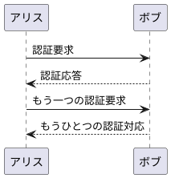
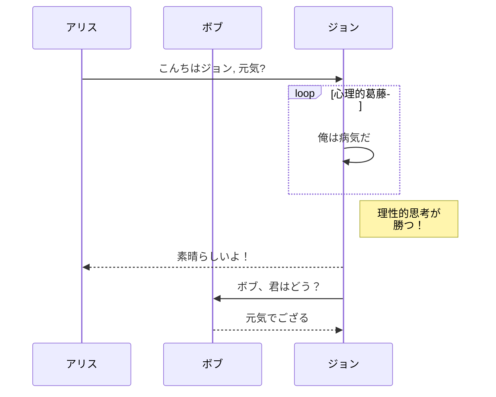
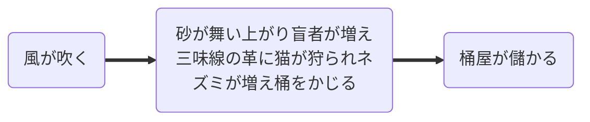

::: block
*ここにドラゴンがいる* {style=background:red;width:500px}
:::

---

// @[vine](etVpwB7uHlw) <br>
[original](https://raw.githubusercontent.com/evilz/vscode-reveal/master/sample.md)<br>
[その他参考](https://zatsugaku-engineer.com/html-css-javascript/reveal-js/#i-17)

---

plantumlを埋め込んだ例




---


### 太陽系探査、1950年代～1960年代

- [ ] Mercury
- [x] Venus
- [x] Earth (Orbit/Moon)
- [x] Mars
- [ ] Jupiter
- [ ] Saturn
- [ ] Uranus
- [ ] Neptune
- [ ] Comet Haley

---

# 表の例

|             |          Grouping           ||
１列名タイトル  | ２列目タイトル | ３列目タイトル |
 ------------ | :-----------: | -----------: |
Content       |          *Long Cell*        ||
Content       |   **Cell**    |         Cell |

新しいセクション   |     ・・・      |         データ |
などなど      | '\\'でエスケープする|       ||

[Prototype table]

--

１列タイトル | ２列目タイトル
-------------|---------------
リスト:        | More  \

- over       | data  \
- several    |       \
- lines      |

--

１列タイトル | ２列目タイトル
-------------|---------------
Merged       | Cell 1
^^           | Cell 2
^^           | Cell 3

--

---

MermaidによるUML等の表示



---



---

# vscode-reveal

 Reveal.jsを使った素晴らしいVSコード拡張

<small>Created by [Vincent B.](https://www.evilznet.com) / [@Evilznet](https://twitter.com/Evilznet)</small>

---

## こんにちは

reveal.jsを使用すると、Markdownを使用して美しいインタラクティブなスライドデッキを作成できます。このプレゼンテーションでは、Reveal.jsができることの例を示します。

---

## 垂直スライド

スライドは、互いにネストすることが可能です。

*Space*キーを使用して、すべてのスライドを移動します。

<a href="#" class="navigate-down">
    
</a>

--

## ベースレベル 1

ネストされたスライドは、高レベルの水平スライドの下に詳細を追加する場合に便利です。

--

## ベースレベル 2

以上です。戻りましょう。

<a href="#/2">
    
</a>

---

## 視点

**Esc**を押してスライドの概要を表示します。

[zoom.js](http://lab.hakim.se/zoom-js)を使用してズームインするには、Altキーを押しながら任意の要素をクリックします。ズームバックするには、Altキーを押しながら任意の場所をクリックします。

>LinuxではCtrl+クリックを使用

---

## スワイプなどにも対応

プレゼンテーションは、携帯電話やタブレットなどのタッチデバイスで表示するのに適しています。スライドをスワイプするだけです

---

## Markdown サポート

```
## Markdown サポート

 インラインまたは外部Markdownを使用してコンテンツを書き込みます。
詳細については [ここ](https://github.com/hakimel/reveal.js#markdown) を読んで下さい。

```

---

## アニメーション

…ステップ実行……

下向けの矢印をクリックします.

<span class="fragment">... これが</span> <span class="fragment">アニメーション表示の</span> <span class="fragment">スライドです</span>

<small>注:
このスライドには、<br>「ノート」ウィンドウでもステップスルーされるアニメーションがあります。</small>

--

## アニメーションスタイル

アニメーションには次のような種類があります。

grow {.fragment .grow}

shrink {.fragment .shrink}

fade-out {.fragment .fade-out}

fade-right{.fragment .fade-right}

fade-up{.fragment .fade-up}

fade-down{.fragment .fade-down}

fade-left{.fragment .fade-left}

--

## アニメーションスタイル

fade-in-then-out{.fragment .fade-in-then-out}

fade-in-then-semi-out {.fragment .fade-in-then-semi-out"}

current-visible {.fragment .current-visible}

Highlight **red**{.fragment .highlight-red} **blue**{.fragment .highlight-blue} **green**{.fragment .highlight-green}

---

## アニメーション効果

次のようなさまざまなアニメーション効果（Transition）を選択できます。

[None](?transition=none#/transitions) - [Fade](?transition=fade#/transitions) - [Slide](?transition=slide#/transitions) - [Convex](?transition=convex#/transitions) - [Concave](?transition=concave#/transitions) - [Zoom](?transition=zoom#/transitions)

---

## テーマ

reveal.jsにはいくつかのテーマ（thema）が組み込まれています。<br>
<a href="#" onclick="document.getElementById('theme').setAttribute('href','libs/reveal.js/3.8.0/css/theme/black.css'); return false;">Black (default)</a> -
<a href="#" onclick="document.getElementById('theme').setAttribute('href','libs/reveal.js/3.8.0/css/theme/white.css'); return false;">White</a> -
<a href="#" onclick="document.getElementById('theme').setAttribute('href','libs/reveal.js/3.8.0/css/theme/league.css'); return false;">League</a> -
<a href="#" onclick="document.getElementById('theme').setAttribute('href','libs/reveal.js/3.8.0/css/theme/sky.css'); return false;">Sky</a> -
<a href="#" onclick="document.getElementById('theme').setAttribute('href','libs/reveal.js/3.8.0/css/theme/beige.css'); return false;">Beige</a> -
<a href="#" onclick="document.getElementById('theme').setAttribute('href','libs/reveal.js/3.8.0/css/theme/simple.css'); return false;">Simple</a> <br>
<a href="#" onclick="document.getElementById('theme').setAttribute('href','libs/reveal.js/3.8.0/css/theme/serif.css'); return false;">Serif</a> -
<a href="#" onclick="document.getElementById('theme').setAttribute('href','libs/reveal.js/3.8.0/css/theme/blood.css'); return false;">Blood</a> -
<a href="#" onclick="document.getElementById('theme').setAttribute('href','libs/reveal.js/3.8.0/css/theme/night.css'); return false;">Night</a> -
<a href="#" onclick="document.getElementById('theme').setAttribute('href','libs/reveal.js/3.8.0/css/theme/moon.css'); return false;">Moon</a> -
<a href="#" onclick="document.getElementById('theme').setAttribute('href','libs/reveal.js/3.8.0/css/theme/solarized.css'); return false;">Solarized</a>

---

<!-- .slide: data-background="#dddddd" -->
## スライド背景色

背景色を変更するには、スライドの<br>
 `data-background="#dddddd"` <br>
を設定します。<br>
すべてのCSS色形式がサポートされています。

[](#){.navigate-down}

--

<!-- .slide: data-background="default-thumbnail.jpg" -->

## 背景イメージ

```markdown
<!-- .slide: data-background="default-thumbnail.jpg" -->
```

--

<!-- .slide: data-background="default-thumbnail.jpg" data-background-repeat="repeat" data-background-size="100px" -->

## 背景タイル

```markdown
<!-- .slide: data-background="default-thumbnail.jpg" data-background-repeat="repeat" data-background-size="100px" -->
```

--

## 背景動画

<!-- .slide: data-background-video="https://upload.wikimedia.org/wikipedia/commons/transcoded/c/c0/Big_Buck_Bunny_4K.webm/Big_Buck_Bunny_4K.webm.480p.vp9.webm" data-background-color="#000000" -->

```markdown
<!-- .slide: data-background-video="https://upload.wikimedia.org/wikipedia/commons/transcoded/c/c0/Big_Buck_Bunny_4K.webm/Big_Buck_Bunny_4K.webm.480p.vp9.webm" data-background-color="#000000" -->
```

--

<!-- .slide: data-background="http://i.giphy.com/90F8aUepslB84.gif" -->


--

<!-- .slide: data-background="http://i.giphy.com/90F8aUepslB84.gif" -->

## ... そしてGIFも表示可

```markdown
<!-- .slide: data-background="http://i.giphy.com/90F8aUepslB84.gif" -->
```

---

<!-- .slide: data-transition="slide" data-background="#4d7e65" data-background-transition="zoom" -->

## 背景のトランジション

backgroundTransitionオプションで、さまざまな背景の遷移を利用できます。これは「ズーム」と呼ばれるものです。

---

<!-- .slide: data-transition="slide" data-background="#b5533c" data-background-transition="zoom" -->

## Background Transitions

背景のトランジションはスライドごとにオーバーライドできます。

---

## きれいなコード表示

```js
function linkify( selector ) {
  if( supports3DTransforms ) {

    var nodes = document.querySelectorAll( selector );

    for( var i = 0, len = nodes.length; i &lt; len; i++ ) {
      var node = nodes[i];

      if( !node.className ) {
        node.className += ' roll';
      }
    }
  }
}
```

[highlight.js](http://softwaremaniacs.org/soft/highlight/en/description/)によるコード構文の強調表示

---

## 素晴らしいリスト

- No order here
- Or here
- Or here
- Or here

---

## 素晴らしい順序付きリスト

1. One is smaller than...
2. Two is smaller than...
3. Three!

---

## Tabular Tables

| Tables        | Are           | Cool  |
|-------------|:-----------:|----:|
| col 3 is      | right-aligned | $1600 |
| col 2 is      | centered      | $12   |
| zebra stripes | are neat      | $1    |

---

{.slide id="ClevQuot"}

## 賢者の名言

名言はインラインで: <q cite="http://searchservervirtualization.techtarget.com/definition/Our-Favorite-Technology-Quotations">規格のいいところは、たくさんある中から選べることです</q>
のようにくくるか、ブロックで表現するか選べます。 

> "何年も前から、何百万匹もの猿が何百万台ものタイプライターでランダムにタイプすれば、シェークスピアの全作品が再現されるという説がある。インターネットは、この説が真実でないことを証明しました。"

---

## スライド間リンク

[リンクへ飛ぶ](#2/3)のように、内部的にスライド間をリンクすることができます。

[Clever Quotes](#ClevQuot)のように、IDでスライド間をリンクすることができます。
ただし、リンク先のスライドでIDを設定しておく必要があります。

```
{.slide id="UniqueID"}
```

---

## スピーカービュー

[スピーカー・ビュー](<https://github.com/hakimel/reveal.js#speaker-notes>)があります。タイマー、次のスライドのプレビュー、スピーカーのメモが表示されます。

 *S* キーを押して試してみてください。

<aside class="notes">そうそう、これはメモです。プレゼンテーションの中では隠れていますが、スピーカーのノートウィンドウを開くと見ることができます（キーボードの「s」を押してください）。</aside>

---

## PDFへの変換

プレゼンテーションはPDFに書き出すことができます。
サンプルは[ここ](https://github.com/hakimel/reveal.js#pdf-export):

<iframe data-src="https://www.slideshare.net/slideshow/embed_code/42840540" width="445" height="355" frameborder="0" marginwidth="0" marginheight="0" scrolling="no" style="border:3px solid #666; margin-bottom:5px; max-width: 100%;" allowfullscreen=""></iframe>

---

## グローバルステート

スライドに `data-state="something"` を設定すると、スライドを開いたときに `"something"` がドキュメント要素にクラスとして追加されます。これにより、ページの背景を切り替えるなど、より広範囲なスタイル変更を適用することができます。

---

<!-- .slide: data-state="customevent" -->

## 状態イベント

さらに、カスタムイベントは `data-state` という名前にバインドすることで、スライドごとにトリガーすることができます。

```js
Reveal.addEventListener( 'customevent', function() {
 console.log( '"customevent" has fired' );
} );
```

---

## 一時停止する

キーボードのBまたは.を押すと、プレゼンテーションが一時停止されます。これは、ステージ上で気が散るようなスライドをスクリーンから取り除きたいときに便利です。

---

## さらに

- 左←右 サポート
- [広範囲な JavaScriptAPI](https://github.com/hakimel/reveal.js#api)
- [自動進行](https://github.com/hakimel/reveal.js#auto-sliding)
- [パララックス背景画像](https://github.com/hakimel/reveal.js#parallax-background)
- [カスタムキーボードバインド](https://github.com/hakimel/reveal.js#keyboard-bindings)

---

## プラグイン

--

## 検索

スライド内の任意の場所でテキスト文字列を検索し、そのスライドに移動して強調表示することで次の出現箇所をユーザーに表示する処理を行います。

**Shortcut : `CTRL + SHIFT + F`**

--

## Zoom

プレゼンのどこでもズームすることができます

**Shortcut :<br> `alt + click`: Zoom in. Repeat to zoom back out.**

--

## ノート

スピーカー ビューにメモを追加します。

デフォルトのマークダウン構文は

```text
note: a custom note here
```

--

## 黒板

黒板に何かをすばやくスケッチできる従来の教室での体験を見逃したことはありませんか?

「b」を押すか、鉛筆のボタンをクリックするだけで、黒板を開いたり閉じたりできます

--

## チョークボード

- 「マウスの左ボタン」をクリックして、黒板に書き込みます
- 「マウスの右ボタン」をクリックして、黒板を拭きます
- 「DEL」キーをクリックして、黒板をクリアします
--

## スライドにメモを作成する

<i class="fa fa-pencil"></i> ボタンに気づきましたか?

「c」を押すかボタンをクリックすると、メモ取りモードを開始および停止して、スライドに直接コメントやメモを書き込むことができます。

--

## チャート

チャートをシンプルな文字列で埋め込むことができます

--

### JSONファイルで折れ線グラフを書く

<canvas class="stretch" data-chart="line">
<!--
{
 "data": {
  "labels": ["January"," February"," March"," April"," May"," June"," July"],
  "datasets":[
   {
    "data":[65,59,80,81,56,55,40],
    "label":"My first dataset","backgroundColor":"rgba(120,120,255,.8)"
   },
   {
    "data":[28,48,40,19,86,27,90],
    "label":"My second dataset","backgroundColor":"rgba(255,120,120,.8)"
   }
  ]
 }, 
 "options": { "responsive": true }
}
-->
</canvas>

--

### CSVデータとJSON構造ファイルで折れ線グラフを描く

<canvas class="stretch" data-chart="line">
My first dataset,  65, 59, 80, 81, 56, 55, 40
<!-- This is a comment -->
My second dataset, 28, 48, 40, 19, 86, 27, 90
<!-- 
{ 
"data" : {
	"labels" : ["Enero", "Febrero", "Marzo", "Avril", "Mayo", "Junio", "Julio"],
	"datasets" : [{ "borderColor": "#0f0", "borderDash": ["5","10"] }, { "borderColor": "#0ff" } ]
	}
}
-->
</canvas>

--

### CSVデータで棒グラフを描く

<canvas class="stretch" data-chart="bar">
,January, February, March, April, May, June, July
My first dataset, 65, 59, 80, 81, 56, 55, 40
My second dataset, 28, 48, 40, 19, 86, 27, 90
</canvas>

--

<!-- .slide: data-background="#aaaaaa" -->
### JSON構造のCSVファイルで積み上げ棒グラフを描く
<!-- By default, chart axes don't "beginAtZero", so set it to true below -->
<!-- Hover events are broken inside reveal https://github.com/chartjs/Chart.js/issues/7178 so "events" : [""] turns it off-->
<canvas class="stretch" data-chart="bar" data-chart-src="https://rajgoel.github.io/reveal.js-demos/chart/data.csv">
<!-- 
{
  "data" : {
    "datasets" : [
      {"backgroundColor": "#0f0"}, 
      {"backgroundColor": "#0ff" }
    ]
  },
  "options": {
    "events": [""],
    "animation": {"easing": "easeOutElastic"},
    "legend": {
      "display": true,
      "labels": {
        "fontColor": "rgb(200, 0, 0)"
      }
    },
    "responsive": true, 
    "scales": { 
      "xAxes": [{
        "ticks": {
          "fontColor" : "rgba(100,100,255,.8)"
        },
        "gridLines" : {
          "color" : "rgba(100,100,255,.8)",
          "zeroLineColor": "transparent"
        },
        "stacked": true
        }],
      "yAxes": [{
        "ticks": {
          "beginAtZero": true,
          "fontColor" : "rgba(100,100,255,.8)"
        },
        "stacked": true,
        "gridLines" : {
          "color" : "rgba(100,100,255,.8)",
          "zeroLineColor": "transparent"
        }
      }] 
    }
  }
}
-->
</canvas>

--

### パイチャート

<canvas class="stretch" data-chart="pie">
,Black, Red, Green, Yellow
My first dataset, 40, 40, 20, 6
My second dataset, 45, 40, 25, 4
</canvas>

--

## ツイートの埋め込み

ツイートを埋め込むには、その URL を特定し、次のコードをスライドに含めます。

```html
<div class="tweet" data-src="TWEET_URL"></div>
```

--

<div class="tweet"  data-src="https://twitter.com/Evilznet/status/1086984843056107525"></div>

--

## メニュー

Reveal.JSプレゼンテーションをナビゲートするためのスライドアウトメニュー
--

隅にある <i class="fa fa-bars"></i> が見えますか?

それをクリックすると、横からメニューが開きます。

スライドの任意の場所をクリックしてプレゼンテーションに戻ります。
または、メニューの閉じるボタンを使用してください。

--

メニューボタンが気に入らない場合は、
代わりにスライド番号を使用できます。

さあ、やってみよう。

メニューボタンは、オプションを使用して非表示にすることができます。
ただし、スライド番号リンクを有効にする必要があります。

--

または、m キーを押してメニューを開くこともできます。

キーボードを使用してメニューをナビゲートすることもできます。
スライドを変更するには、矢印キーと <space> または <enter> を使用するだけです。

必要に応じてオプションのメニューのキーボードを無効にすることができます。

--

## 左と右

スライドを左送りにするか右送りにするかを切り替えることができます。

--

### マーカー

メニューのマーカーは、プレゼンテーションの進捗状況を表示するのに便利です。

必要に応じて非表示にすることができます。

スライド番号の表示/非表示もできます。

--

### スライドタイトル

メニューは最初の見出しを使用して各スライドにラベルを付けます
ただし、必要に応じて別のラベルを指定できます。<br><br>

section 要素で data-menu-title 属性を使用して、スライドにカスタム ラベルを付けるか、スライド内の任意の要素に menu-title クラスを追加します。<br><br>

titleSelector オプションを変更して各スライドにラベルを付けるためのデフォルトとして、好きな要素を使用できます.

--

## SVGファイル描画

LaTeX を SVG でレンダリングできるようにする math.js プラグインの拡張機能
--

### ローレンツ方程式

<span>
\[\begin{aligned}
\dot{x} &amp; = \sigma(y-x) \\
\dot{y} &amp; = \rho x - y - xz \\
\dot{z} &amp; = -\beta z + xy
\end{aligned} \]
</span>

--

### コーシー・シュバルツの不等式

<script type="math/tex; mode=display">
  \left( \sum_{k=1}^n a_k b_k \right)^2 \leq \left( \sum_{k=1}^n a_k^2 \right) \left( \sum_{k=1}^n b_k^2 \right)
</script>

--

### カスタムフッター

Reveal.jsプレゼンテーションのすべてのスライドに、プレゼンテーションのタイトルを示すフッターが含まれます(一部のスライドはオプションで除外)。

--

## コードフォーカス

コードブロックの特定の行にフォーカスできるようにするプラグイン。

--

### コードフォーカスのデモ

```html
<section>
  <pre><code>
  // Useless comment.
  alert('hi');
  </pre></code>
  <p class="fragment" data-code-focus="1">
    This focuses on the comment.
  </p>
  <p class="fragment" data-code-focus="1-2">
    Another fragment.
  </p>
</section>
```

<small>

このセクションはスライドです。<br>{.fragment.current-only data-code-focus=1-12}

これは`highlight.js`で強調表示されます。<br>{.fragment.current-only data-code-focus=2-5}

このフラグメントは最初の行に焦点を合わせています。<br>{.fragment.current-only data-code-focus=6-8}

このフラグメントは1行目と2行目に焦点を当てています。<br>{.fragment.current-only data-code-focus=9-11}

このコードブロックの内容を説明するデモについては、次のスライドを参照してください。<br>{.fragment.current-only data-code-focus=1-12}

</small>
---

<!-- .slide: style="text-align: left;" -->
# 以上！

- [オンラインエディタを試す](http://slides.com)
- [ソースとドキュメント](https://github.com/hakimel/reveal.js)
